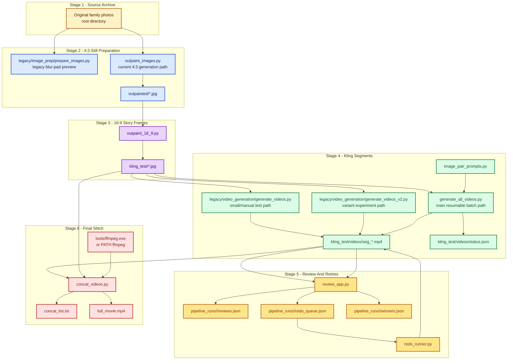
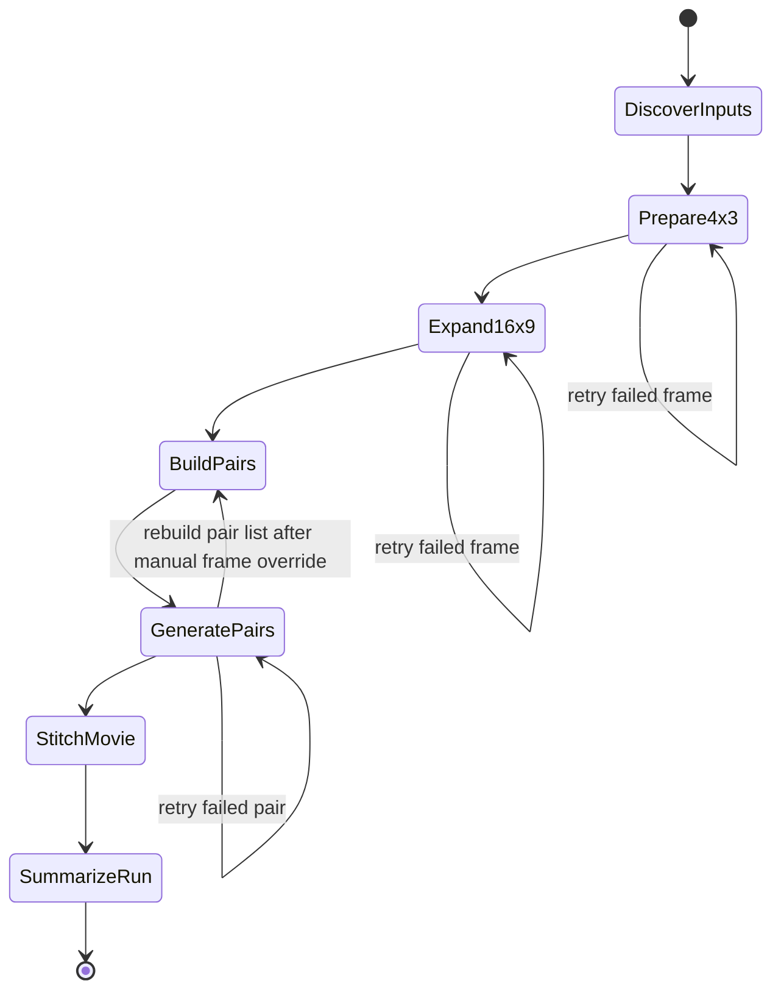

# End-to-End Pipeline for Olga Movie

> **Phase 2 update (2026-04-23):** the Python scripts below are now *also*
> driven by a FastAPI service at `backend/` exposing 14 endpoints (project
> CRUD, uploads, four stage jobs, review, polling, artifact download).
> Mock mode serves the `tests/fixtures/fake_project/` Cosmo fixture for
> zero-API-cost E2E. The Streamlit `review_app.py` runs untouched alongside.
> See `docs/backend-api.md` and `docs/roadmap/phase_2_execution.md` for
> endpoint details and Phase-3 caveats.

## Goal

Turn a mixed set of family photographs into a single stitched movie:

1. Normalize source images into consistent 4:3 landscape stills.
2. Expand numbered story frames into 16:9 images for Kling.
3. Generate start-frame/end-frame Kling clips for consecutive image pairs.
4. Review generated clips, queue weak segments for redo, and regenerate better versions.
5. Stitch the selected winning clips into one final movie.

This document describes the current checked-in flow in this workspace. Historical experiments and optional quality-control ideas are kept in the appendix.

## Scope

The current pipeline is file-based and script-driven. It is not yet an orchestrated agent. The working path is:

`raw images -> outpainted/ -> kling_test/ -> kling_test/videos/ -> review app + redo queue -> full_movie.mp4`

## Pipeline Summary

- Root image files are the source archive.
- `outpaint_images.py` converts mixed-orientation photos into 4:3 outputs in `outpainted/`.
- `outpaint_16_9.py` converts numbered 4:3 story frames into 16:9 outputs in `kling_test/`.
- `generate_all_videos.py` creates resumable Kling clips for consecutive numbered pairs and records progress in `kling_test/videos/status.json`.
- `review_app.py` lets a human review clips, pick winners, and queue bad clips for retry.
- `redo_runner.py` turns queued retry feedback into a rewritten prompt and submits new Kling versions when requested.
- `concat_videos.py` builds `concat_list.txt` and stitches existing segment files into `kling_test/videos/full_movie.mp4`.

## End-to-End Flow

```mermaid
flowchart LR
    A["Raw source images\nroot *.jpg / *.png"] --> B["4:3 normalization\noutpaint_images.py"]
    B --> C["4:3 outputs\noutpainted/*.jpg"]
    C --> D["16:9 expansion\noutpaint_16_9.py"]
    D --> E["Kling-ready frames\nkling_test/*.jpg"]
    E --> F["Pair prompts\nimage_pair_prompts.py"]
    E --> G["Batch Kling generation\ngenerate_all_videos.py"]
    F --> G
    G --> H["Segment outputs\nkling_test/videos/seg_*.mp4\nstatus.json"]
    H --> I["Human review + winner selection\nreview_app.py"]
    I --> J["Redo queue + prompt rewrite\nredo_runner.py"]
    J --> G
    I --> K["Concat list + ffmpeg stitch\nconcat_videos.py"]
    K --> L["Final movie\nkling_test/videos/full_movie.mp4"]

    classDef src fill:#f4efe1,stroke:#7c5f18,color:#1f1a12,stroke-width:2px;
    classDef img fill:#dbeafe,stroke:#1d4ed8,color:#0f172a,stroke-width:2px;
    classDef video fill:#dcfce7,stroke:#15803d,color:#052e16,stroke-width:2px;
    classDef out fill:#fee2e2,stroke:#b91c1c,color:#450a0a,stroke-width:2px;
    classDef review fill:#ede9fe,stroke:#6d28d9,color:#2e1065,stroke-width:2px;

    class A src;
    class B,C,D,E,F,G img;
    class H,K video;
    class I,J review;
    class L out;
```



## Artifact Flow



## Main Stages

### Stage 1: Source Archive

The root directory contains the original photos plus a few derived artifacts. These source images are treated as the input archive.

Key properties:
- Mixed orientations and aspect ratios.
- Some already match 4:3 landscape.
- Some are portrait photos that need extension rather than simple cropping.

### Stage 2: 4:3 Still Preparation

Primary script: `outpaint_images.py`

Purpose:
- Load each source image.
- Apply EXIF transpose and any explicit rotation overrides.
- If the image is already close to 4:3, resize and copy it.
- Otherwise extend it to 4:3 landscape and save it to `outpainted/`.

Input:
- Root image files.

Output:
- `outpainted/*.jpg`
- `outpainted/scores.json` as a run record

Important note:
- The checked-in script contains judge helpers, but the current runtime path saves outputs directly and records `scores: null` in `scores.json`.
- In other words, the current main flow for this stage is generation-focused, not judge-gated.

Legacy companion:
- `legacy/image_prep/prepare_images.py` remains as a blur-pad fallback and quick preview path.
- It is not the preferred path for the movie flow because blur-padded edges can create transition artifacts in Kling.

Watermark cleaning:
- Every Gemini-produced save in `outpaint_images.py` is routed through
  `watermark_clean.clean_if_enabled(path)` before the file is handed off.
- Cleaner is in-place, fail-soft, opt-out via `WATERMARK_CLEAN=off`.
- Detection is dimension-gated to Gemini's standard `1376×768`; other
  sizes (e.g. GPT outputs) pass through unmodified.

### Stage 3: 16:9 Story Frame Expansion

Primary script: `outpaint_16_9.py`

Purpose:
- Read numbered images from `outpainted/`.
- Extend each frame from 4:3 to 16:9.
- Save the numbered story sequence to `kling_test/`.

Input:
- Numbered `outpainted/*.jpg` files.

Output:
- `kling_test/*.jpg`

Important note:
- This stage is prompt-driven and does not include a checked-in judge loop.
- Retry behavior here is manual or ad hoc, based on rerunning a failed frame with a modified prompt.

Watermark cleaning:
- Every Gemini save in `outpaint_16_9.py`, `gemini_pro_extend.py`
  (both PNG and JPEG branches), and the `review_app.py` extend step
  is routed through `watermark_clean.clean_if_enabled(path)`.
- Same contract as Stage 2: in-place, fail-soft, opt-out via
  `WATERMARK_CLEAN=off`, 60 s subprocess timeout, one automatic retry.

### Stage 4: Kling Clip Generation

Primary script: `generate_all_videos.py`

Purpose:
- Read numbered images from `kling_test/`.
- Sort them in story order, including suffixed frames like `33_b`.
- Build consecutive pairs.
- Submit each pair to Kling image-to-video using the start frame and end frame.
- Record resumable progress in `kling_test/videos/status.json`.

Input:
- `kling_test/*.jpg`
- `image_pair_prompts.py`
- Kling API credentials from `.env`

Output:
- `kling_test/videos/seg_<a>_to_<b>.mp4`
- `kling_test/videos/status.json`

Behavior details:
- Uses JWT auth built from access key and secret key.
- Refreshes the token during long runs.
- Skips already completed pairs on rerun.
- Records submit failures and poll failures without losing prior successes.

Related scripts:
- `legacy/video_generation/generate_videos.py` is the earlier small/manual script for the first pairs.
- `legacy/video_generation/generate_videos_v2.py` is a variant-testing path for prompt styles.
- `generate_all_videos.py` is the main batch path for the full movie.

### Stage 5: Review And Redo Loop

Primary tools: `review_app.py`, `redo_runner.py`

Purpose:
- Review generated Kling segments inside a local Streamlit app.
- Mark a version as approved, redo, or needs discussion.
- Save structured review feedback into JSON.
- Preview and run queued retries from the app.
- Rewrite retry prompts from review feedback with Gemini when available, or fall back to rule-based prompt repair.
- Generate a new version like `seg_<pair>_v2.mp4` and move the queue item to `waiting_review`.

Input:
- `kling_test/videos/seg_*.mp4`
- `image_pair_prompts.py`
- `pipeline_runs/<run_id>/reviews.json`
- `pipeline_runs/<run_id>/redo_queue.json`
- Gemini and Kling credentials from `.env` when live retries are run

Output:
- `pipeline_runs/<run_id>/reviews.json`
- `pipeline_runs/<run_id>/redo_queue.json`
- `pipeline_runs/<run_id>/winners.json`
- versioned retry clips such as `kling_test/videos/seg_17_to_18_v2.mp4`

Behavior details:
- The app preview shows `prompt_mode` as either `llm_rewrite` or `rule_based`.
- A successful retry changes a queue item from `queued` to `waiting_review`.
- `waiting_review` items stay visible but are not submitted again.
- Once the new version is reviewed, the old waiting entry is removed so the queue does not loop forever.

### Stage 6: Final Stitch

Primary script: `concat_videos.py`

Purpose:
- Reconstruct timeline order from the image sequence in `kling_test/`.
- Include only segment files that actually exist in `kling_test/videos/`.
- Build `concat_list.txt`.
- Use ffmpeg stream copy to stitch the final movie with no re-encode.

Input:
- `kling_test/*.jpg`
- `kling_test/videos/seg_*.mp4`
- ffmpeg from PATH or `tools/ffmpeg.exe`

Output:
- `kling_test/videos/concat_list.txt`
- `kling_test/videos/full_movie.mp4`

Behavior details:
- If ffmpeg is not present and the platform is Windows, the script can download a portable build into `tools/`.
- The concat path is designed to preserve source quality by using `-c copy`.

## Tool Reference

| Tool | Stage | What it does | Main input | Main output | Notes |
|---|---|---|---|---|---|
| `legacy/image_prep/analyze_images.py` | Analysis | Inventories dimensions, EXIF orientation, and face-related metadata | root images | console output | Diagnostic only |
| `legacy/image_prep/prepare_images.py` | 4:3 prep | Creates blur-padded 4:3 previews | root images | `processed/*.jpg` | Legacy fallback |
| `outpaint_images.py` | 4:3 prep | Produces 4:3 landscape stills from mixed-orientation sources | root images | `outpainted/*.jpg` | Contains inactive judge helpers in current checked-in flow |
| `outpaint_16_9.py` | 16:9 prep | Extends numbered 4:3 stills to 16:9 Kling-ready frames | `outpainted/*.jpg` | `kling_test/*.jpg` | Main bridge into the video pipeline |
| `image_pair_prompts.py` | Kling prompts | Stores pair-specific cinematic prompts | pair keys | prompt strings | Used by `generate_all_videos.py` |
| `legacy/video_generation/generate_videos.py` | Kling generation | Generates a small early set of pairs manually | `kling_test/*.jpg` | `segment_*.mp4` | Early test path |
| `legacy/video_generation/generate_videos_v2.py` | Kling generation | Generates prompt-style variants for small comparisons | `kling_test/*.jpg` | variant mp4 files | Experimental path |
| `generate_all_videos.py` | Kling generation | Runs the resumable batch movie generation loop | `kling_test/*.jpg`, `.env`, prompt map | `seg_*.mp4`, `status.json` | Main production path |
| `review_models.py` | Review | Defines review, redo, and winner state records | app state | in-memory models | Shared review data schema |
| `review_store.py` | Review | Reads and writes reviews, redo queue, and winners | `pipeline_runs/<run_id>/*.json` | updated JSON state | Local review state layer |
| `review_app.py` | Review | Streamlit UI for reviewing clips, queueing redos, and picking winners | `seg_*.mp4`, frame jpgs, review JSON | updated review JSON | Main human review tool |
| `redo_runner.py` | Review / Kling retry | Previews queued retries, rewrites prompts, and submits retry versions | redo queue, pair prompts, `.env` | `seg_*_vN.mp4`, updated redo queue | Uses Gemini rewrite when available |
| `concat_videos.py` | Stitch | Builds concat list and creates the full movie | `seg_*.mp4`, image sequence, ffmpeg | `full_movie.mp4` | Final assembly step |
| `legacy/image_prep/qa_report.py` | QA | Builds a comparison report for manual inspection | selected image sets | report artifact | Support tooling |

## File And Directory Roles

| Path | Role |
|---|---|
| root `*.jpg` | source archive and some historical artifacts |
| `processed/` | blur-pad preview outputs |
| `outpainted/` | normalized 4:3 stills |
| `outpainted/scores.json` | stage record for 4:3 generation runs |
| `kling_test/` | numbered 16:9 frames for the story sequence |
| `kling_test/videos/` | Kling clip outputs, concat list, and final movie |
| `pipeline_runs/<run_id>/` | review state for human feedback, retry queue, and winners |
| `tools/` | local ffmpeg binary when auto-downloaded |
| `_cursor/` | Cursor transcripts, tools, assets, and terminal history used to reconstruct project history |

## Operational Notes

### Credentials

The pipeline expects credentials in `.env`:
- Gemini key for image generation stages.
- Kling access key and secret key for video generation.

### Resume Behavior

The movie pipeline is resumable at the Kling stage.
- `generate_all_videos.py` persists pair status in `status.json`.
- Re-running the script skips pairs already marked `ok`.
- Failed or incomplete pairs can be retried without recreating successful outputs.

The review loop is also resumable.
- `review_app.py` persists reviews, redo queue state, and winners under `pipeline_runs/<run_id>/`.
- `redo_runner.py` only submits items with `status = queued`.
- After a successful retry, the item moves to `waiting_review` and is not re-submitted automatically.

### Retry Prompt Rewrite

The current retry flow has two prompt-repair modes:
- `llm_rewrite`: Gemini rewrites the retry prompt from the base pair prompt plus the reviewer feedback.
- `rule_based`: the local fallback appends deterministic repair instructions when Gemini is unavailable.

The app exposes the active mode in the redo preview table through the `prompt_mode` field.

### Ordering Rules

The story order is filename-based.
- Plain numeric frames sort numerically.
- Suffixed frames like `33_b` sort immediately after `33` and before `34`.
- `concat_videos.py` reconstructs clip order from the image sequence, not just from status records.

### Current Accuracy Boundaries

This document intentionally distinguishes between:
- current checked-in runtime behavior
- historical experiments captured in `_cursor/`
- optional future improvements

That separation matters because some design ideas, especially judge-gated retries, were explored and partially coded but are not active in the current main runtime path.

## Controller Spec For A Future Agent

The future agent should not wrap the existing scripts blindly. It should own a single manifest, treat every stage as idempotent, and make retries explicit.

### Controller Responsibilities

The controller is responsible for:
- discovering inputs and assigning stable frame ids
- deciding which stages must run and which can be skipped from manifest state
- calling the existing stage scripts or future library equivalents
- writing all state transitions into one manifest file
- retrying only the failed unit of work, not the whole pipeline
- producing a final run summary that points to all generated artifacts

### Controller Inputs

Minimum required inputs:

| Input | Type | Purpose |
|---|---|---|
| `project_root` | path | Base workspace path |
| `source_dir` | path | Directory containing source images |
| `run_id` | string | Unique identifier for one full movie build |
| `sequence_mode` | enum | `explicit_manifest` or `filename_order` |
| `target_stages` | list | Subset of `prepare_4x3`, `expand_16x9`, `generate_pairs`, `stitch_movie` |
| `gemini_image_model` | string | Model used for still generation stages |
| `kling_model` | string | Model used for Kling clip generation |
| `ffmpeg_path` | optional path | Explicit ffmpeg binary if auto-discovery is not desired |

Recommended optional inputs:

| Input | Type | Purpose |
|---|---|---|
| `frame_sequence` | list | Explicit ordered frame ids when story order must not be derived from filenames |
| `pair_prompt_source` | enum/path | Use `image_pair_prompts.py` or an external prompt data file |
| `retry_policy` | object | Stage-specific retry limits and backoff |
| `quality_policy` | object | Thresholds for optional image and segment QA |
| `resume` | bool | Whether to reuse existing outputs from the manifest |
| `allow_manual_overrides` | bool | Whether operator edits can pin or skip individual frames or pairs |

### Manifest As The System Of Record

The controller should create one canonical manifest per run, for example:
- `pipeline_runs/<run_id>/manifest.json`

Suggested top-level schema:

```json
{
  "run_id": "2026-03-06-olga-movie-v1",
  "created_at": "2026-03-06T00:00:00Z",
  "project_root": "D:/Programming/olga_movie",
  "source_dir": "D:/Programming/olga_movie",
  "sequence_mode": "filename_order",
  "stages": {
    "prepare_4x3": {"status": "pending"},
    "expand_16x9": {"status": "pending"},
    "generate_pairs": {"status": "pending"},
    "stitch_movie": {"status": "pending"}
  },
  "frames": [],
  "pairs": [],
  "artifacts": {
    "concat_list": null,
    "full_movie": null
  },
  "summary": {
    "source_count": 0,
    "prepared_count": 0,
    "expanded_count": 0,
    "pair_count": 0,
    "segment_ok_count": 0
  }
}
```

Suggested `frames[]` record:

```json
{
  "frame_id": "33_b",
  "source_path": "D:/Programming/olga_movie/A 005.jpg",
  "source_sha256": "...",
  "source_dimensions": [2000, 3000],
  "sequence_index": 34,
  "classification": {
    "kind": "portrait",
    "is_numbered_story_frame": true
  },
  "prepare_4x3": {
    "status": "ok",
    "output_path": "D:/Programming/olga_movie/outpainted/33_b.jpg",
    "method": "pro_outpaint",
    "attempts": 1,
    "judge": null
  },
  "expand_16x9": {
    "status": "ok",
    "output_path": "D:/Programming/olga_movie/kling_test/33_b.jpg",
    "attempts": 1
  }
}
```

Suggested `pairs[]` record:

```json
{
  "pair_id": "33_to_33_b",
  "start_frame_id": "33",
  "end_frame_id": "33_b",
  "sequence_index": 33,
  "prompt": {
    "source": "image_pair_prompts.py",
    "version": "current",
    "text": "Gentle tracking shot..."
  },
  "kling": {
    "status": "ok",
    "attempts": 1,
    "task_id": "...",
    "error": null,
    "video_path": "D:/Programming/olga_movie/kling_test/videos/seg_33_to_33_b.mp4",
    "size_mb": 7.4
  },
  "qa": {
    "status": "pending",
    "score": null,
    "notes": null
  }
}
```

### Stage Contracts

Each stage should operate as a pure contract: consume manifest state, do one job, update manifest, and stop.

| Stage | Consumes | Produces | Success contract | Failure contract |
|---|---|---|---|---|
| `discover_inputs` | `source_dir` | `frames[]` skeleton | Every source image has a stable `frame_id`, hash, dimensions, and sequence classification | Stop run if source discovery is ambiguous |
| `prepare_4x3` | source frames | `outpainted/*.jpg`, frame records | Each frame marked `ok`, `copy`, `skipped`, or `failed` with output path and attempts | Failed frame does not block unrelated frames |
| `expand_16x9` | prepared numbered frames | `kling_test/*.jpg` | Every numbered story frame has a 16:9 output or explicit failure state | Failed frame blocks only downstream pairs that depend on it |
| `build_pairs` | ordered numbered frames | `pairs[]` | Every consecutive valid story frame becomes one pair record with prompt payload | Stop if sequence is invalid or missing required frames |
| `generate_pairs` | `pairs[]`, Kling creds | `seg_*.mp4`, pair records | Pair marked `ok` only after video exists on disk | Pair stays retryable on submit or poll failure |
| `stitch_movie` | successful pair outputs | `concat_list.txt`, `full_movie.mp4` | Final movie exists and manifest lists exactly which pair outputs were included | Stop if there are no stitchable segments |
| `summarize_run` | full manifest | summary block | Final counts and paths are consistent with artifacts on disk | Never mutates prior stage outputs |

### Controller State Diagram



### Retry Rules

The controller should retry the smallest unit of work possible.

#### Global rules

- Never restart a full run because one frame or one pair failed.
- Persist every attempt count in the manifest.
- Write the last error string and timestamp for every failure.
- Stop retrying automatically when the retry budget is exhausted.
- Allow manual operator override to mark a unit as `skip`, `accept`, or `retry_later`.

#### Stage-specific retry policy

| Stage | Unit of retry | Automatic retries | Stop condition |
|---|---|---|---|
| `discover_inputs` | whole stage | 0 | Any ambiguity in stable frame ordering or duplicate frame ids |
| `prepare_4x3` | one frame | 2 retries after first failure | frame remains `failed` after 3 total attempts |
| `expand_16x9` | one frame | 2 retries after first failure | frame remains `failed` after 3 total attempts |
| `generate_pairs` submit | one pair | 2 retries with fresh auth/token | pair remains `submit_fail` after 3 total attempts |
| `generate_pairs` poll/download | one pair | 2 retries | pair remains `poll_fail` or `download_fail` after 3 total attempts |
| `stitch_movie` | whole stage | 1 retry after rebuilding concat list | no valid concat set or ffmpeg failure persists |

#### Downstream blocking rules

- A frame that fails `prepare_4x3` cannot enter `expand_16x9`.
- A frame that fails `expand_16x9` blocks any pair that references it.
- A failed pair does not block stitching of already successful pairs unless the operator requires a gap-free final movie.
- The controller should support both:
  - `strict_story = true`: stop before stitch if any required pair is missing
  - `strict_story = false`: stitch only successful contiguous segments or explicitly approved gaps

### Manual Override Contract

The agent should expect human review at four points:
- source ordering and frame inclusion
- acceptance of 4:3 prepared stills for sensitive images
- acceptance or rewrite of pair prompts for key transitions
- final approval of which generated segments should be re-done before stitch

Suggested override file:
- `pipeline_runs/<run_id>/overrides.json`

Example responsibilities of overrides:
- pin exact sequence order
- skip a source image entirely
- replace an auto-selected prompt for one pair
- force-regenerate one pair with a new prompt version
- exclude one segment from final concat

### Minimal Controller Interface

A pragmatic controller entry point would support:

```text
python pipeline_controller.py run --run-id <id>
python pipeline_controller.py resume --run-id <id>
python pipeline_controller.py stage --run-id <id> prepare_4x3
python pipeline_controller.py retry --run-id <id> pair 33_to_33_b
python pipeline_controller.py retry --run-id <id> frame 18
python pipeline_controller.py stitch --run-id <id>
python pipeline_controller.py report --run-id <id>
```

### Why This Spec Is The Right Level

This spec stays close to the current repo:
- it preserves the existing directory structure
- it treats current scripts as stage implementations
- it uses one manifest instead of scattered status files
- it keeps the retry boundary at frame or pair level
- it is concrete enough for an agent, but not over-abstracted

## Appendix A: Judge And QA Material

### What the judge was meant to do

The original 4:3 design included a comparative judge loop:
- compare original portrait vs generated landscape output
- score seamlessness, style match, person preservation, and naturalness
- retry with a stronger prompt when the score falls below threshold

### Where that logic exists

- `architecture.md` previously described the judge as part of the main flow.
- `outpaint_images.py` still contains a `JUDGE_PROMPT` and `judge()` helper.
- `_cursor/agent-transcripts/` includes history describing a single-image judged run and an intended auto-retry design.

### Why it is appendix-only here

The current checked-in execution path in `process_single()` does not call `judge()` and does not store active score payloads in `scores.json`.

So the judge is best documented as:
- historical intent
- partial implementation
- future improvement candidate

not as an always-on stage in the current pipeline.

## Appendix B: Historical Script Evolution

- `prepare_images.py` was the original deterministic 4:3 fallback.
- `outpaint_images.py` replaced blur-padding as the preferred still-prep path.
- `outpaint_16_9.py` was added when the movie workflow shifted toward Kling-ready widescreen frames.
- `generate_videos.py` handled the first test pairs.
- `generate_videos_v2.py` explored prompt variants.
- `generate_all_videos.py` became the main resumable batch generator.
- `concat_videos.py` finalized the movie with ffmpeg stream copy.
